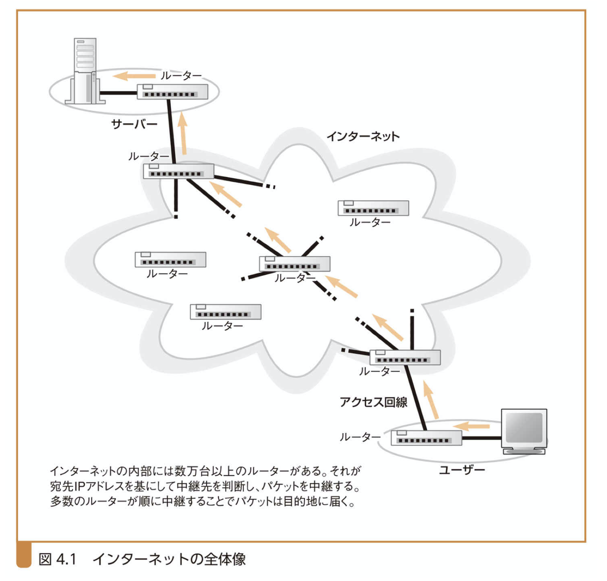
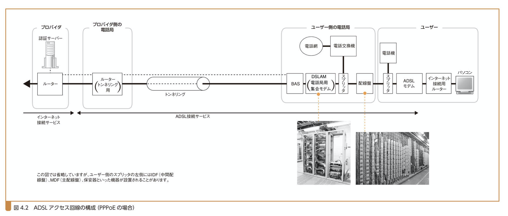
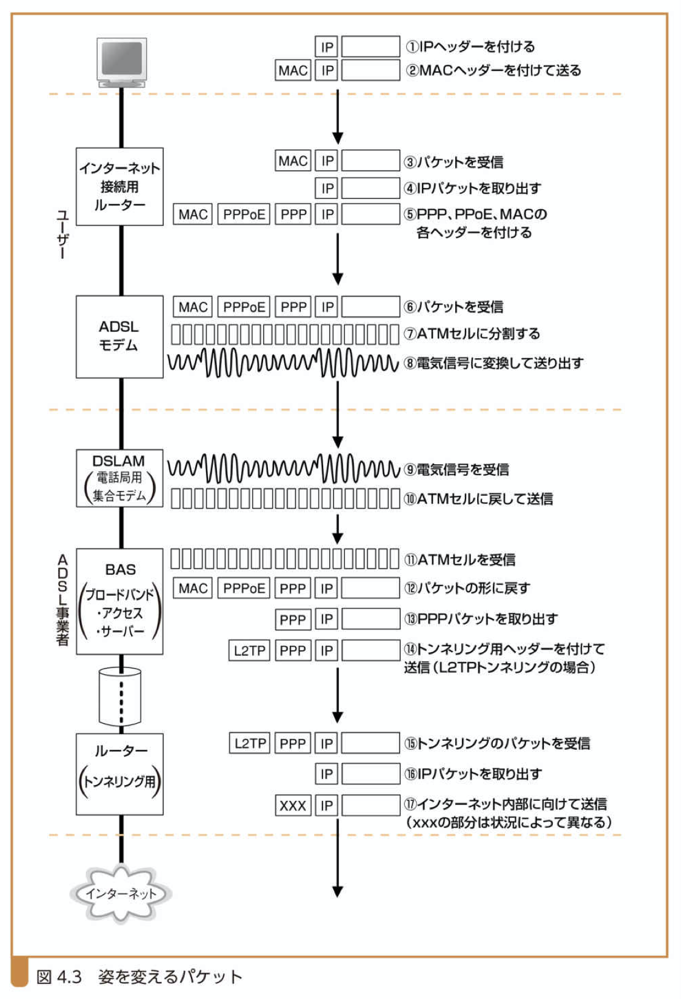
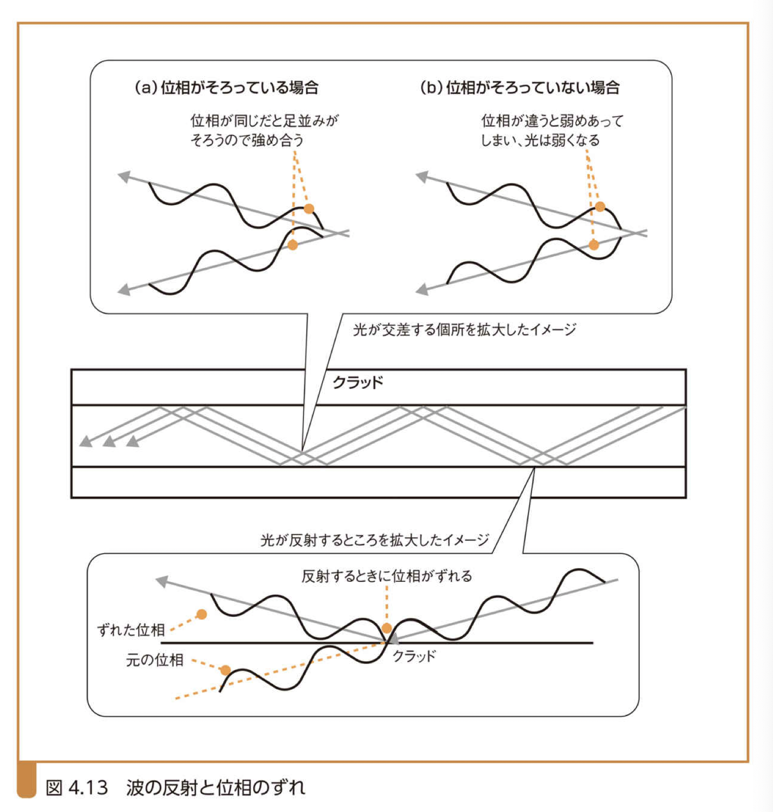
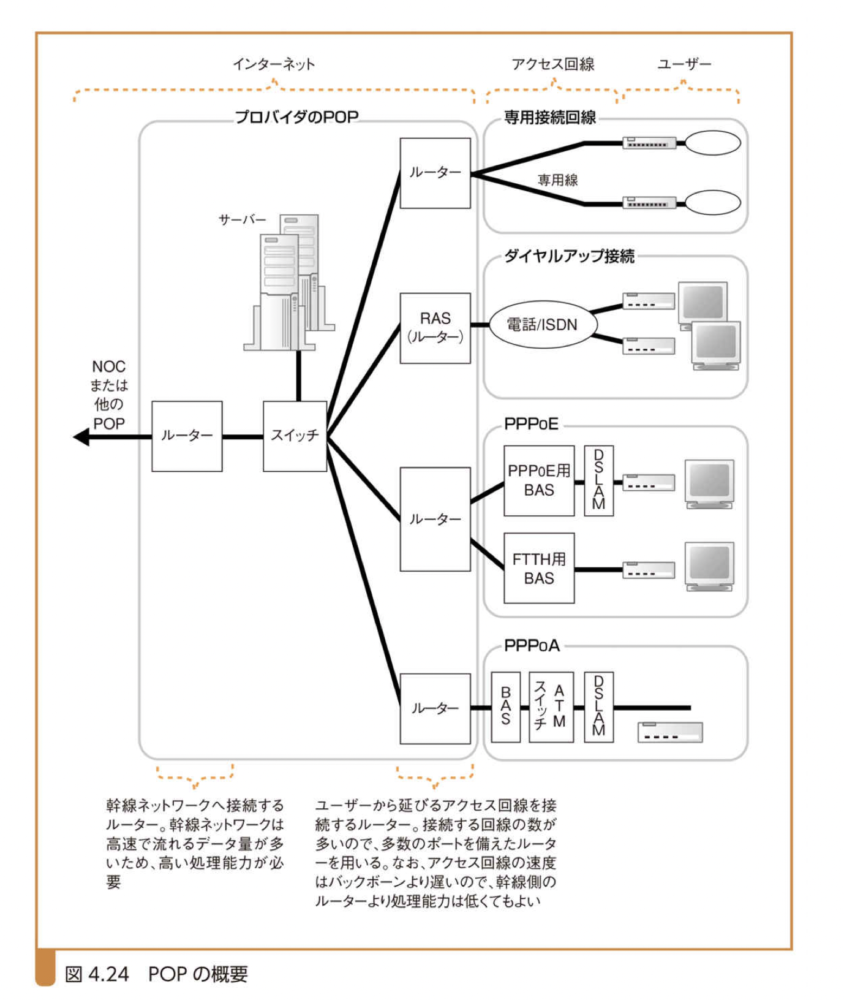

# ネットワークはなぜ繋がるのか

## 第4章 アクセス回線を通ってインターネットの内部へ～アクセス回線とプロバイダを探検～

### 見所

1. 家庭や会社のLANはアクセス回線と呼ぶ通信回線でプロバイダにつながっている。ADSLはアクセス回線の一種であり、その構成、電話線の中を流れる信号、電話と共存させる方法。
2. 光ファイバもアクセス回線（FTTH）。構造、シングル・マルチモードの違い、ケーブルの性質、アクセス回線として使う場合の姿。
3. 本人認証、プロバイダからユーザーへのグローバルアドレスの通知。プロバイダからパケットを運ぶところでトンネリングと言う技術を使うことがある。
4. アクセス回線の先はプロバイダのネットワーク。プロバイダ間で経路情報を交換してルーターの経路表に登録する機能があるのは家庭や社内のLANとは異なる。
5. インターネットは多数のプロバイダのネットワークを相互に接続した巨大なネットワーク。

### 4.1ADSL技術を用いたアクセス回線の構造と動作

#### 4.1.1インターネットの基本は家庭や社内のLANと同じ

#### 

インターネットの基本動作は家庭や会社のLANと同じ。**違いの一つは中継装置間の距離。LANはせいぜい数メートルから数百メートル。インターネットは数キロメートル。**海を越える必要があるので、イーサネットのケーブルで繋ぐというわけにはいかない。

**ルーターでパケットの中継先を制御するところも違う。経路表の情報に基づいて中継先を判断する部分は同じだが、経路表へ情報を登録する部分が違う。**通信障害や、インターネットに新たに接続する会社などがあるので、時々刻々と経路が変わったり追加されたりするので、その部分が自動化されている。

#### 4.1.2ユーザーとインターネットを結ぶアクセス回線

インターネット接続用ルーターとイーサネットのルーターも**中継動作はほぼ同じ**だが、送信動作が少し違う。**インターネット接続用ルーターはアクセス回線のルールに従ってパケット送信動作を実行する。**アクセス回線というのは、インターネットと家庭や会社のLANを結ぶ通信回線のこと。

#### 4.1.3ADSLモデムでパケットをセルに分割

ユーザー側のルーターから送信されたパケットは、ADSLモデムや電話のケーブルを通って電話局に届き、そこから、ADSL事業者のネットワークを経由してプロバイダ（ISP：インターネット・サービス・プロバイダ）に届く。パケットはその間にいろいろな形に姿を変える。

（④）までは、イーサネットのルーター間の動作と変わらない。**インターネット接続用ルーターは、MACヘッダー、PPPoEヘッダー、PPPヘッダーの3つを付けて、ADSLモデムにパケットを送付する（PPPoEの場合）。ADSLモデムは受け取ったパケットをセルに分割し、電気信号に変えてスプリッタに送信する。**セルとはATM（AsynchronousTransferMode。電話回線の考え方に基づいた従来型の電話技術の延長上にある通信方式）で使う通信技術でパケットを小さくしたもの。

#### 4.1.4ADSLは「変調方式」でセルを信号化

LANの場合は四角い形の信号で0と1で表す方式で、データを信号に変換する。**ADSLモデムはなだらかな波形（正弦波）を合成した信号に0と1のビット値を対応づける技術を使う。この技術を変調技術と呼ぶ。**ADSLは、振幅変調（ASK）という方式と、位相変調（PSK）という方式を組み合わせた直交振幅変調（QAM）という方式を使う。

#### 4.1.5ADSLは波を多数使い高速化を実現

周波数の異なる波を混ぜ合わせて波を合成し、特定の周波数の波だけ通すフィルタ回線を使い、周波数ごとに波を分離することができる。**周波数別の波にビット数を対応づけることで全体の伝送速度を高速化。**上りと下りで扱う周波数を変えている。下りが高周波数。

#### 4.1.6スプリッタの役割

電気信号に変換したセルはスプリッタという装置に入る。ADSLの信号は電話の音声信号と混じって電話回線に一緒に流れ出ていく。ここでは特に仕事をしない。**電話回線から信号が入ってきた場合に電話とADSLの信号を分けるのがスプリッタの役割。電話機側にADSLの信号が流れていかないように一定の周波数を越える信号をカットする。**ADSLモデムの内部にはADSLで使わない周波数をカットする機能がある。

#### 4.1.7電話局までの道のり

**スプリッタの先は電話ケーブルを差し込むモジュラ・コネクタ。そこを通過し、電話の屋内配線を通り抜けると、IDF、MDFなどの配線板があり、外からの配線とビル内の配線が繋がれている。これを過ぎたら、保安機があり、過大な電流が流れないように保護されている。そこを抜けたら信号は電柱の電話ケーブルに入っていく。このケーブルはユーザーの近くでは電柱に敷設されているが、途中で地下に入っていく**。これは電話局まで電柱で引っ張ると、電話局に近づくにつれて電柱だらけになり防災上問題があるからである。電話局に入っていったケーブルは、電話局のMDFに一本一本繋ぎ込まれる。

#### 4.1.8雑音の影響

電話ケーブルの中で信号は雑音（クロストーク）の影響を受ける。また、電話ケーブルはADSLの高い周波数の信号を流すことを想定して作ったものではないので、イーサネットのツイストペア・ケーブルより雑音の影響を受けやすい。ただ、**ADSLの信号は多数の周波数に分かれており、雑音の周波数と重なる信号だけが影響を受けて使えなくなり、直ちにエラーになるのではなく速度が低下する。**例えば、電車の線路脇などでは、電車がパンタグラフで架線から電力を受けるとき、火花が散って雑音が放射されることがありますが、その影響を受けて速度が低下することがある。ケーブルの内部で発生する雑音の影響を受けることもある。

#### 4.1.9DSLAMを通過してBASに届く

**電話ケーブルを通って電話局にたどり着いた信号は、配線盤、スプリッタを通過してDSLAMに届く。**DSLAMとは、DSLAccessMultiplexerの略。電話局用のADSL集合モデム。多数のADSLモデムを1つの筐体に収めた機器。ここで、電気信号はデジタル・データのセルに戻される。**DSLAMが信号の波形を読み取って、振幅と位相を調べ、それがどのビット値に対応するか判断してデジタル・データに戻す。この動作はユーザー側にあるADSLモデムの受信動作と同じである。**ユーザー側の**ADSLモデムはイーサネット・インターフェースを持ち、ユーザー側のルーターやパソコンとやり取りするときはイーサネットのパケットの格好で送受信する**のに対して、**DSLAMの方は、イーサネットの代わりにATMインタフェースを持つものが大半で、パケットを分割したセルの形のままで後方のルーターとやり取りする。**

**DSLAMを出たセルは、BAS（BroadbandAccessServer）と呼ぶパケット中継装置に届く（⑪）。BASが持つATMインターフェースにより、セルから元のパケットの形に戻す**。次にパケットからPPPヘッダー以降の部分を取り出し（⑬ ）、トンネリング用のヘッダーをつけて、トンネリングの出口に向けて中継する（⑭）。

パケットはトンネリングの出口にあるトンネリング用のルータに届き（⑮）、トンネリング用のヘッダーを外してIPパケットを取り出し（⑯）、インターネットの内部に中継する（⑰）。

### 4.2光ファイバを用いたアクセス回線（FTTH）

#### 4.2.1光ファイバの基本

**光ファイバを用いたアクセス回線をFTTHと呼ぶ。**光信号は灯りが点いた明るい状態がデジタル・データの1を表し、暗い状態が0を表す。**デジタル・データを一度電気信号に変換してから、その電気信号を光の信号に変換する。**この電気信号をLEDやフォトダイオードなどの光源に入力すると、信号の電圧に応じて光を出す。**光は光ファイバの中を進んで受信側に届き、受信側は明るさから電圧を生み、電気信号、デジタル・データと順に変換する。**

#### 4.2.2シングルモードとマルチモードの違い

光ファイバの中心部分にはコアという部分があり、それを覆うクラッドとの境界を反射しながら光は進行する。入射角が大きすぎる光は屈折し外に漏れ、入射角が一定以内の光は全反射して進む。光ファイバに入射する光はいろいろな角度のものがあるが、反射するときに位相がずれるため、その中で、反射したときに位相がそろう角度で入射した少数の光だけが遠くに届く。

**コアの太さが細いものをシングルモード、太いものをマルチモードという。シングルモードは**

**位相がそろう角度の中の一番角度が小さい光しか入ってこないため、信号の精度が高く長距離向け。**ただし、光源や受光素子の性能も高くする必要がある。**FTTHではシングルモード光ファイバを使うと思って良い。**マルチモードは位相がそろう角度の光が複数入ってくる。そのため、光が進む道筋の距離に差が生まれ、信号が到達するまでの時間にずれが生じる。結果として、信号が変形してしまい、許容限度を超えると通信エラーを起こす。短い距離でなら問題はなく、安価なため、一つの建物の中を結ぶ用途に使う。

ADSLの代わりに、この光ファイバを使ってユーザー側のインターネット接続用ルーターとインターネット側のBASを接続するのがFTTHアクセス回線。

### 4.3アクセス回線で用いるPPPとトンネリング

#### 4.3.1本人確認と設定情報通知

**ADSLやFTTHなどのアクセス回線からインターネットに向けて流れてきたパケットは、アクセス回線を運営する事業者が所有するBASに届く。**インターネットは、元々、多数のルーターをつなぎ合わせて作ったものなので、アクセス回線をルーターにつなぐのが原則。そして、**アクセス回線がADSLやFTTHに進化したので、それに合わせて、アクセス回線をつなぐルーターも進化した。その進化したルーターがBASである。**進化した内容は以下。

まず、**本人確認と設定値通知の機能。**アクセス回線はログイン動作を実行しないとアクセス回線に接続できない。BASはその動作の窓口役であり、それを実現するためにPPPoE（Point-to-Point Protocol over Ethernet）と呼ぶ仕組みを使う。

**PPPoEの基になったダイヤルアップ接続のPPPの説明を行う。プロバイダのアクセスポイントに接続し、繋がったらユーザー名とパスワードを入力しログイン操作を行う。認証サーバーに転送され、正しいと確認できたら、認証サーバーからIPアドレスなどの設定情報が返送される**ので、それをユーザー側に転送する。ユーザーのパソコンはその情報に従って、IPアドレスなどを設定し、TCP/IPのパケットを送受信する準備が整う。

#### 4.3.2イーサネットでPPPメッセージをやり取りするPPPoE

ADSLやFTTHはユーザーとBASをケーブルで固定的に接続するので本人確認をする必要はない。ユーザーとパスワードを入力する動作を残しておくことで、ユーザー名によってプロバイダを切り替えることができ、便利なのでADSLやFTTHでもPPPの仕組みを残してある。

PPPプロトコルにはイーサネットのプリアンブルやFCSに相当する規定がなく、信号の規定もないので、**PPPのメッセージをそのまま信号に変換して送信することはできない。PPPメッセージを送信するときは、HDLCプロトコルというパケットのような入れ物を利用している。イーサネットはPPPとは考え方が違うところがあるので、そのギャップを埋める仕様を新たに作りました。その仕様を「PPPoE」と呼ぶ。**

PPPメッセージをイーサネットのパケットに入れて運ぶようにすれば、ADSLやFTTHでもダイヤルアップ回線と同じように通信できる。

#### 4.3.3トンネリング機能によってプロバイダにパケットを届ける

BASには、トンネリングという考え方を使ってパケットを運ぶ機能もある。このトンネリングという考え方は、ソケットとソケットの間をつなぐTCPのコネクションと似ている。TCPコネクションの一方の出入口（ソケット）からデータを入れると、そのデータがそのままの形でもう一方の出入口に届くが、トンネリングはこれと同じ。

この考え方を使って**BASとプロバイダのルーターの間にあるADSL／FTTH接続サービス事業者のネットワークの中にトンネルを作り、そこにユーザーとBASを結ぶアクセス回線をつなぐ。すると、ユーザーからプロバイダのルーターまで1本の道ができあがり、パケットはそこを通ってインターネット内部に入っていく**。

#### 4.3.4アクセス回線全体の動き

アクセス回線の動きは、ユーザー側にインターネット接続用ルーターを設置してインターネットに接続するところから始まる。インターネット接続用ルーターにプロバイダから割り当てられたユーザー名とパスワードを登録する。インターネット接続用ルーターはPPPoEのDiscoveryという仕組みに従ってBASのMACアドレスを探し出す。

そうしたら、本人確認や設定値通知動作を実行する。パスワードを確認した後、BASからユーザーに対してTCP/IPの設定情報を通知し、インターネット接続用ルーターのBAS側ポートに設定される。ここで通知する情報は、インターネットに接続する機器に割り当てるIPアドレス、DNSサーバーのIPアドレス、デフォルト・ゲートウエイのIPアドレスといったもの。これでインターネット接続用ルーターの準備は完了。

BASは、インターネット接続用ルーターから送られてきたパケットを受け取り、MACヘッダーとPPPoEヘッダーを取り除いた後、トンネリングの仕組みを使ってプロバイダのルーターに向けて送信する。

#### 4.3.5IPアドレスを割り当てないアンナンバード

1対1の形態で接続されたポートに、IPアドレスを割り当てなくてもよいという特例がある。それを「アンナンバード」という。

#### 4.3.6インターネット接続用ルーターでプライベート・アドレスからグローバル・アドレスに変換

**インターネット接続用ルーターを使うと、BASが通知した設定情報をルーターが受け取ってしまい、グローバル・アドレスはルーターに割り当てられてしまいます。これでは、パソコンにグローバル・アドレスを割り当てることはできない。**

**その場合、パソコンにはプライベート・アドレスを割り当て、パソコンが送ったパケットはインターネット接続用ルーターでアドレス変換してからインターネットに中継される。**アプリケーションの中には、自分のIPアドレスを通信相手や制御用のサーバーに通知するものがありますが、アドレス変換の仕組みがその通知動作に対応できないことがある。

その場合、つまり、アドレス変換の影響でアプリケーションが正しく動かない場合には、ルーターを使わずに、BASが通知するPPPoEのメッセージをパソコンが受け取る格好でインターネットにつなぐと良い。

### 4.4プロバイダの内部

#### 4.4.1POPとNOC

ADSLやFTTHのアクセス回線は、ユーザーが契約しているプロバイダの設備につながっています。その設備をPOP(Point of Presence)と呼ぶ。

POPの構成はアクセス回線数やプロバイダの事業形態などによって異なりますが、おおむね図4.24のような格好。

電話回線やISDN回線といったダイヤルアップ回線をつなぐところはRASと呼ぶルーターを使う。RASには、ユーザーからかかってきた電話を取る機能と本人確認と設定情報を通知する機能が備わっている。

**PPPoEの場合は、ADSLやFTTHを運営する事業者の中にBASが設置されており、それとつなぐためのルーターがプロバイダに設置される。PPPoEを用いた本人確認や設定情報通知の動作はADSLやFTTHの事業者にあるBASが窓口役となる。プロバイダのルーターはパケットを中継するだけの普通のルーター。**

NOC(Network Operation Center)はプロバイダの中核となる設備で、POPから入ってきたパケットはそこに集まる。そこから目的地の近くにあるPOPまたは他のプロバイダへとパケットは流れていく。

#### 4.4.2建物の外は通信回線などで接続

**POPやNOCは規模こそ違えど、会社にあるサーバールームに似ている。ルーターをケーブルで直接接続したり、スイッチを経由して接続したり、会社や家庭のLANと同じ。ただ、扱うパケットの量が多いので、そういった箇所にはツイストペア・ケーブルではなく光ファイバーを用いる。**

建物の外など離れた場所にあるPOPやNOCを結ぶ方法はいくつかある。

一つは自分で光ファイバを所有しているプロバイダが取る方法。その光ファイバを使って離れた場所にあるPOPやNOCを結ぶだけ。

それ以外のプロバイダは、光ファイバを所有する会社から光ファイバの機能の一部を借りる。この種の事業で光ファイバの一部を貸し出すサービスを通信回線と呼ぶ。

### 4.5プロバイダをまたがって流れるパケット

#### 4.5.1プロバイダ同士の接続

POPのルーターに届いたパケットの動きを見ていく。最終目的地となるWebサーバーがクライアントと同じプロバイダに接続されている場合、POPのルーターの経路表に中継先が登録されているはずなので、その中継先にパケットを送る。この動作を繰り返すうちに、Webサーバー側のPOPに設置したルーターにたどり着き、そこからWebサーバーに向かう。

サーバー側のプロバイダがクライアント側と違う場合はどうなるか。パケットをサーバー側のプロバイダに送らなかればいけないですが、その時の中継先も経路表に登録されている。プロバイダは他のプロバイダとも経路情報を交換しあっており、ルーターには他のプロバイダの経路情報も登録されている。

結局、**最終目的地が同一プロバイダであろうが他プロバイダであろうが、全ての経路が登録されているので、経路表で次の中継先を探してパケットを送るという動作を繰り返せば、そのうちWebサーバー側のPOPにたどり着く。**

#### 4.5.2プロバイダ同士で経路情報を交換

どうやってプロバイダ間で経路情報を交換するのか。

**接続相手から経路情報を教えてもらう。相手から経路情報を教えて貰えば、そちらにどんなネットワークがあるのか分かるようになる。教えてもらった経路情報を経路表に登録すれば、そちらにパケットを送れるようになる。**この経路情報交換はルーターが自動的に行い、この仕組みをBGP(Border Gateway Protocol)という。

#### 

